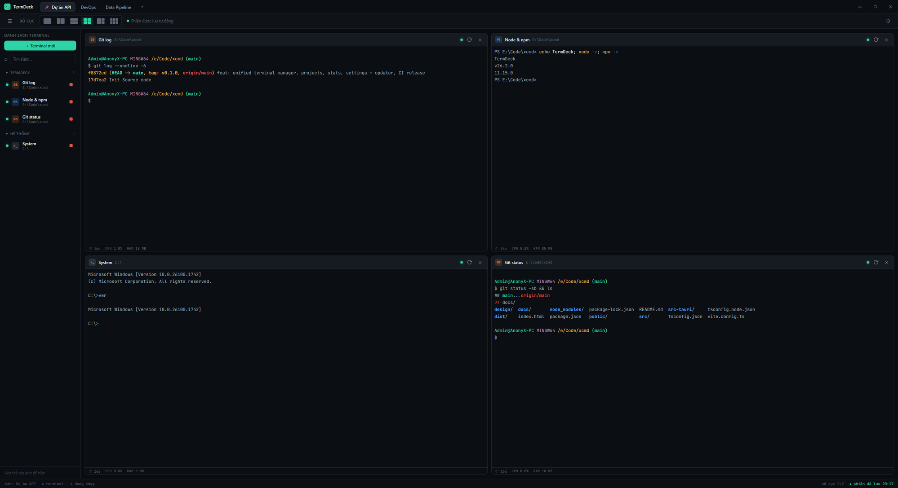

<div align="center">

# TermDeck

**Dashboard quản lý terminal — gom cmd / PowerShell / Git Bash / WSL vào một chỗ, khoa học, đỡ nhầm lẫn.**

Chạy nhiều terminal thật trong một cửa sổ: chia theo **tab**, xếp thành **lưới**, nhóm theo **dự án**, xem **CPU/RAM/uptime** từng cái, và **khôi phục nguyên trạng** khi mở lại.

Nhẹ (~2.6 MB) nhờ **Tauri v2 + Rust + React** — không phải Electron.

[**⬇ Tải bản mới nhất**](https://github.com/Anony68/TermDeck/releases) · Windows · macOS · Linux



</div>

---

## TermDeck là gì?

Khi bạn chạy nhiều dự án cùng lúc, mỗi dự án lại vài terminal (dev server, watcher, git, logs…), cửa sổ terminal rời rạc rất dễ lạc và nhầm. **TermDeck** biến chúng thành một *bảng điều khiển* duy nhất: terminal **thật** (gõ lệnh, chạy tiến trình như bình thường) được sắp xếp gọn gàng theo lưới, gom nhóm theo dự án, và luôn quay lại đúng như lúc bạn rời đi.

## Tính năng chính

- **Terminal thật, nhiều loại** — PowerShell, CMD, Git Bash, WSL. Tự dò shell có trên máy.
- **Lưới linh hoạt** — 6 mẫu bố cục (1, 1×2, 2×1, 2×2, 1 lớn + 2, 3×2), **kéo–thả** để đổi vị trí, lưới tự lớn lên khi thêm terminal.
- **Tab = khung hiển thị** — mỗi tab là một cách bày biện riêng. Terminal **chạy nền** kể cả khi ẩn; ẩn/hiện tuỳ ý, **ghim** để hiện ở mọi tab. Kéo–thả & ghim tab.
- **Danh sách Terminal = trung tâm quản lý** — trạng thái đang chạy/đã tắt, nút **Dừng/Chạy lại**, chuột phải để **Sửa / Ghim / Tắt / Xóa**.
- **Nhóm theo dự án** — lưu danh sách dự án (tên + thư mục) để gợi ý & chọn nhanh; sidebar tự gom terminal theo dự án.
- **Thông số từng terminal** — ⏱ thời gian chạy · CPU% · RAM (cộng cả cây tiến trình con, ví dụ `npm run dev` tính luôn tiến trình `node`).
- **Khôi phục phiên** — mở lại đúng shell, đúng thư mục, đúng bố cục, đúng tên. Có **ảnh phiên** (snapshots) để quay lại.
- **Tinh chỉnh** — cỡ chữ terminal, **thu phóng toàn ứng dụng**, menu chuột phải trong terminal (Sao chép / Dán / Chọn tất cả / Xóa màn hình), **kiểm tra cập nhật qua GitHub**.

## Tải & cài đặt

Vào [**Releases**](https://github.com/Anony68/TermDeck/releases) và tải installer cho hệ điều hành của bạn:

| Hệ điều hành | File |
|---|---|
| Windows | `TermDeck_x.y.z_x64-setup.exe` (NSIS) hoặc `.msi` |
| macOS | `TermDeck_x.y.z_*.dmg` (Intel & Apple Silicon) |
| Linux | `.AppImage` / `.deb` |

## Công nghệ

**Tauri v2** (khung app, WebView2/WebKit) · **Rust** (`portable-pty` → ConPTY, `sysinfo` cho thống kê) · **React + TypeScript + Vite** · **xterm.js** (render terminal) · **Zustand** + `@tauri-apps/plugin-store` (trạng thái & lưu phiên).

## Phát triển

Yêu cầu: **Node.js ≥ 18**, **Rust** (Windows cần **MSVC** + **Microsoft C++ Build Tools** + **Windows SDK**; macOS cần Xcode CLT; Linux cần `webkit2gtk` v.v.), và WebView2 (có sẵn trên Windows 11).

```bash
npm install
npm run tauri dev      # chạy app ở chế độ dev
npm run tauri build    # đóng gói installer cho OS hiện tại
npm run dev            # (tuỳ chọn) chỉ xem giao diện trong trình duyệt, terminal là placeholder
```

> Lưu ý Windows: dự án dùng toolchain **MSVC**. Nếu `rustup` mặc định là `-gnu`, đặt override:
> `rustup override set stable-x86_64-pc-windows-msvc`

Bản release đa nền tảng được build tự động bằng **GitHub Actions** (`.github/workflows/release.yml`) khi push tag `v*`.

## Cấu trúc

```
src/                       # Frontend React/TS
  components/              # TitleBar, TabStrip, Toolbar, Sidebar, Grid, Pane,
                           # KeepAliveTerminal, TerminalLayer, StatusBar, ContextMenu…
  dialogs/AddCmdDialog     # dialog thêm/sửa Terminal
  settings/SettingsWindow  # Cài đặt: Chung, Dự án, Phiên & Khôi phục, Bố cục, Shell, Phím tắt, Cập nhật
  state/store.ts           # Zustand (tabs / panes / projects / settings / snapshots) + persist
  ipc/                     # cầu nối Rust: pty, shells, dialog, window, stats, update
src-tauri/src/
  pty.rs                   # PtyManager: spawn/write/resize/kill + reader/waiter thread → Channel
  shells.rs                # dò PowerShell / CMD / Git Bash / WSL
  lib.rs                   # commands + plugin (dialog/store/opener) + bộ lấy CPU/RAM
```

## Giấy phép

Sử dụng nội bộ / cá nhân. © Anony68.
