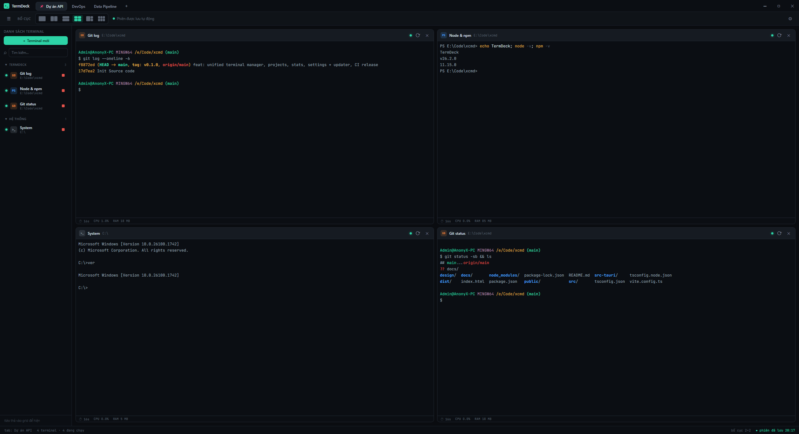

<div align="center">

# TermDeck

**A VPS manager — keep your servers in one tidy place, each with an interactive SSH terminal and a built-in SFTP file manager.**

Add a VPS once (host, user, password or `.pem` key), pick it from the sidebar, and get a live **SSH terminal** and a dual-pane **SFTP** browser for it — side by side, no separate tools.

Lightweight (~3 MB installer) thanks to **Tauri v2 + Rust + React** — not Electron.

[**⬇ Download the latest release**](https://github.com/Anony68/TermDeck/releases) · Windows · macOS · Linux



</div>

---

## What is TermDeck?

TermDeck is a control panel for the servers you SSH into. Each **VPS** is one saved SSH connection; selecting it opens a detail view with two tabs:

- **Terminal** — a real interactive SSH shell (auto-reconnects if the link drops).
- **Files (SFTP)** — a dual-pane file manager, opened from the *same* connection, no re-login.

Connections stay alive in the background as you switch between servers.

## Features

### VPS connections (SSH)
- **Password or private key (.pem)** auth. Passwords/passphrases are stored in the **OS credential store** (Windows Credential Manager / macOS Keychain), never in the config file. Host keys are pinned on first use (TOFU) to guard against MITM.
- **Import** existing hosts from `~/.ssh/config`, or a Bitvise Tunnelier `.tlp` profile.
- **Interactive terminal** (xterm.js) with copy/paste that works: select + right-click (or Ctrl/Cmd+C) to copy, right-click with no selection (or Ctrl/Cmd+V) to paste; Ctrl/Cmd+C with no selection sends SIGINT.

### Built-in SFTP file manager
- **Dual-pane browser** — local filesystem on one side, remote SFTP on the other. Browse, filter, create / rename / delete / chmod.
- **Recursive upload & download** with a live progress bar and a per-batch summary, and **Overwrite / Skip / Cancel** conflict handling.
- **One-way directory sync** (rclone-style mirror) *Local ▶ Remote* or *Remote ▶ Local*, behind a confirmation dialog.
- **Edit-in-place** — open a remote file in your editor; every save re-uploads automatically.
- **Fast navigation** — marquee drag-select, type-ahead jump, Backspace for parent, Delete to remove, F5 to reload.

### Workspace & polish
- **VPS list** with search and per-host connection status.
- **Session restore** — reopens the last selected VPS. Export / import your VPS list as JSON.
- **Tuning** — terminal font size, whole-app zoom, VI/EN language, and a **GitHub-based update check** with one-click download-and-install.

## Download & install

Head to [**Releases**](https://github.com/Anony68/TermDeck/releases) and grab the installer for your OS:

| OS | File |
|---|---|
| Windows | `TermDeck_x.y.z_x64-setup.exe` (NSIS) or `.msi` |
| macOS | `TermDeck_x.y.z_*.dmg` (Intel & Apple Silicon) |
| Linux | `.AppImage` / `.deb` |

## Tech stack

**Tauri v2** (app shell, WebView2/WebKit) · **Rust** (`ssh2`/libssh2 for SSH & SFTP, `keyring` for secrets, `notify` for edit-in-place) · **React + TypeScript + Vite** · **xterm.js** (terminal rendering) · **Zustand** + `@tauri-apps/plugin-store` (state & persistence).

## Development

Requirements: **Node.js ≥ 18**, **Rust** (Windows needs **MSVC** + **Microsoft C++ Build Tools** + **Windows SDK**; macOS needs Xcode CLT; Linux needs `webkit2gtk`, etc.), and WebView2 (bundled with Windows 11).

```bash
npm install
npm run tauri dev      # run the app in dev mode
npm run tauri build    # bundle an installer for the current OS
```

> On macOS the committed `bundle.targets` are Windows-only; build the mac bundle with
> `npm run tauri build -- --bundles app,dmg`.

Cross-platform releases are built by **GitHub Actions** (`.github/workflows/release.yml`) when a `v*` tag is pushed.

## Project structure

```
src/                       # React/TS frontend
  components/              # TitleBar, Toolbar, Sidebar (VPS list), HostDetail,
                           # KeepAliveTerminal, TerminalLayer, StatusBar,
                           # FileBrowser + FilePanel (SFTP dual-pane), PropertiesDialog…
  components/transfer.ts   # recursive upload/download with conflict resolution
  components/sync.ts       # rclone-style one-way directory mirror
  dialogs/AddHostDialog    # add/edit a VPS (SSH connection)
  settings/SettingsWindow  # Settings: General, Session, Editor, Shortcuts, Updates
  state/store.ts           # Zustand (hosts / settings) + persist; sessions derived per host
  ipc/                     # Rust bridge: ssh (SSH/SFTP + local FS), session, edit, persist, update
src-tauri/src/
  ssh.rs                   # SSH terminals + SFTP + local FS (ssh2/libssh2, keyring, host-key pinning)
  edit.rs                  # edit-in-place watcher for remote files
  lib.rs                   # command registration + plugins (dialog/store/opener/clipboard)
```

## License

Internal / personal use. © Anony68.
